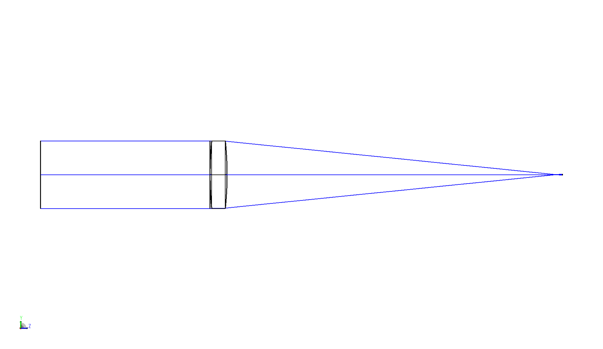

# ZOSPy

[](https://pypi.org/project/zospy)

[](https://anaconda.org/conda-forge/zospy)

[](https://zospy.readthedocs.io/en/latest/?badge=latest)
[][joss-paper]
[](https://zenodo.org/badge/latestdoi/403590410)

## About

Wrapper around the [Ansys OpticStudio][opticstudio] API that provides a more intuitive way to interact with the 
[ZOS-API][zos-api] through Python using a .NET connection, as described in [this Journal of Open Source Software paper][joss-paper].
It thereby allows you to do more optics modelling with less coding.

In addition to full access to all the OpticStudio fucntions through the ZOS-API, ZOSPy provides the following features:

- Wrapper functions for several OpticStudio analyses in `zospy.analyses`;
- Easy access to solvers in `zospy.solvers`;
- Easy access to all API constants in `zospy.constants`;
- Autocomplete for all ZOS-API endpoints and constants;
- Solves common problems related to Python.NET 3 and interaction with the ZOS-API.

## Installing

ZOSPy is available on PyPi

```
pip install zospy
```

And through conda:

```
conda install conda-forge::zospy
```

## Example

Create and draw a simple optical system consisting of a single lens:

```python
import matplotlib.pyplot as plt
import zospy as zp

zos = zp.ZOS()
oss = zos.connect()

# Create a new, empty system
oss.new()

# Set aperture and wavelength
oss.SystemData.Aperture.ApertureType = zp.constants.SystemData.ZemaxApertureType.FloatByStopSize
oss.SystemData.Wavelengths.GetWavelength(1).Wavelength = 0.543  # in μm

# Set the object at infinity
surface_object = oss.LDE.GetSurfaceAt(0)
surface_object.Thickness = float("inf")

# Add a dummy surface for visualization purposes
input_beam = oss.LDE.InsertNewSurfaceAt(1)
input_beam.Comment = "input beam"
input_beam.Thickness = 10

# Use a stop diameter of 4 mm
surface_stop = oss.LDE.GetSurfaceAt(2)
surface_stop.SemiDiameter = 2

# Add a lens with n = 1.5
lens_front = oss.LDE.InsertNewSurfaceAt(3)
lens_front.Comment = "lens front"
lens_front.Radius = 20
lens_front.Thickness = 1
zp.solvers.material_model(lens_front.MaterialCell, refractive_index=1.5)

lens_back = oss.LDE.InsertNewSurfaceAt(4)
lens_back.Comment = "lens back"
lens_back.Radius = -20
lens_back.Thickness = 19.792  # System is in focus

# Show the system in the 3D viewer
draw_3d = zp.analyses.systemviewers.Viewer3D(surface_line_thickness="Thick", rays_line_thickness="Thick").run(oss)

plt.imshow(draw_3d.Data)
plt.axis("off")
plt.show()
```



Please refer to the [documentation](https://zospy.readthedocs.io) for more information on how to use ZOSPy.
More elaborate examples can be found in the [example gallery](https://zospy.readthedocs.io/en/latest/examples.html).

## Warranty and liability

The code is provided as is, without any warranty. It is solely intended for research purposes. No warranty is given and
no rights can be derived from it, as is also stated in the [MIT license](LICENSE.txt).

## Dependencies

ZOSPy officially supports Python 3.9 - 3.13. It may work with older Python versions, but support is not provided for
these versions. Furthermore, a working installation of [Ansys Zemax OpticStudio](https://www.zemax.com/pages/opticstudio) is required.

## Compatibility

See the [documentation](https://zospy.readthedocs.io/compatibility) for the most up-to-date compatibility information.

## Referencing

When publishing results obtained with this package, please cite [our paper][joss-paper] 
in the Journal of Open Source Software:  

> Vught, L. van, Haasjes, C. & Beenakker, J.W.M. (2024). 
> ZOSPy: Optical ray tracing in Python through OpticStudio. 
> Journal of Open Source Software, 9(96), 5756. 
> https://doi.org/10.21105/joss.05756

## Contributing

Please read our [contribution guidelines](CONTRIBUTING.md) prior to opening a Pull Request.

## Contact

Feel free to contact us via e-mail at [zospy@mreye.nl](mailto:zospy@mreye.nl) for any inquiries,
or visit [mreye.nl](https://mreye.nl) to discover our research.

[opticstudio]: https://www.ansys.com/products/optics/ansys-zemax-opticstudio
[zos-api]: https://support.zemax.com/hc/en-us/articles/1500005578742-Basic-method-of-performing-system-analysis-in-ZOS-API
[joss-paper]: https://joss.theoj.org/papers/10.21105/joss.05756
