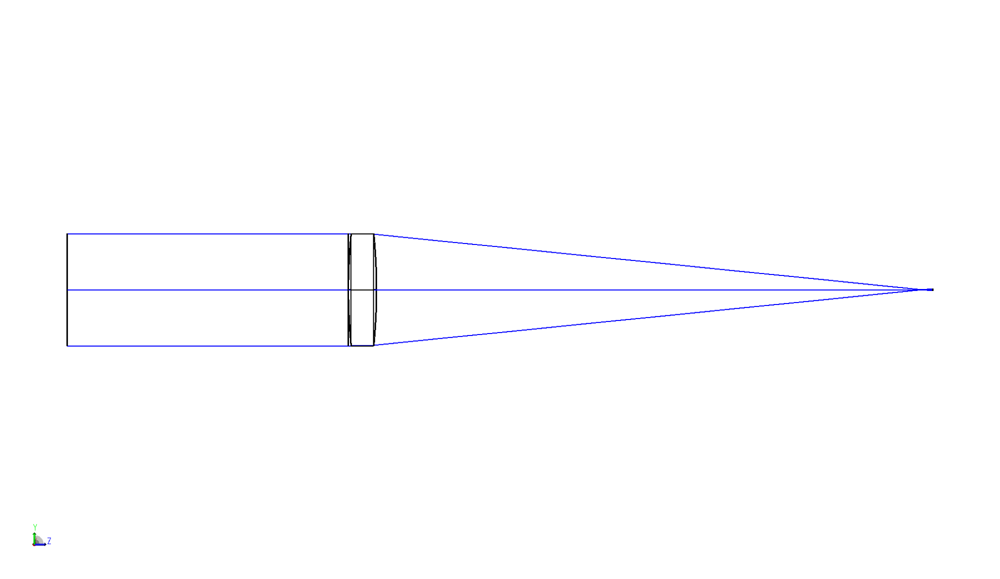

# Simple example

This example creates a simple optical system consisting of a single lens, and runs a single ray trace analysis.

```python
import matplotlib.pyplot as plt
import zospy as zp

zos = zp.ZOS()
oss = zos.connect()

# Create a new, empty system
oss.new()

# Set aperture and wavelength
oss.SystemData.Aperture.ApertureType = zp.constants.SystemData.ZemaxApertureType.FloatByStopSize
oss.SystemData.Wavelengths.GetWavelength(1).Wavelength = 0.543  # in μm

# Set the object at infinity
surface_object = oss.LDE.GetSurfaceAt(0)
surface_object.Thickness = float("inf")

# Add a dummy surface for visualization purposes
input_beam = oss.LDE.InsertNewSurfaceAt(1)
input_beam.Comment = "input beam"
input_beam.Thickness = 10

# Use a stop diameter of 4 mm
surface_stop = oss.LDE.GetSurfaceAt(2)
surface_stop.SemiDiameter = 2

# Add a lens with n = 1.5
lens_front = oss.LDE.InsertNewSurfaceAt(3)
lens_front.Comment = "lens front"
lens_front.Radius = 20
lens_front.Thickness = 1
zp.solvers.material_model(lens_front.MaterialCell, refractive_index=1.5)

lens_back = oss.LDE.InsertNewSurfaceAt(4)
lens_back.Comment = "lens back"
lens_back.Radius = -20
lens_back.Thickness = 19.792  # System is in focus

# Show the system in the 3D viewer
draw_3d = zp.analyses.systemviewers.Viewer3D(surface_line_thickness="Thick", rays_line_thickness="Thick").run(oss)

plt.imshow(draw_3d.data)
plt.axis("off")
plt.show()

# Trace a single chief ray
raytrace = zp.analyses.raysandspots.SingleRayTrace(hx=0, hy=1, px=0, py=0, wavelength=1, global_coordinates=True).run(oss)
```

