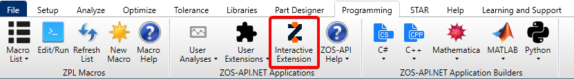

# Connecting to OpticStudio

To use ZOSPy, you need to connect to OpticStudio. This can be done in two ways:

1. **Standalone mode**: a new, invisible instance of OpticStudio is started and closed when the script is finished.
  This is the default mode used by ZOSPy.
  It is also the most performant option, because updating the GUI appears to significantly slow down simulations.
2. **Extension mode**: the script connects to an already running instance of OpticStudio.
  To be able to connect in extension mode, the 'Interactive Extension' mode must be activated in OpticStudio.
  This is useful for debugging, or when you want to see the simulation progress in the GUI.

## Connecting in standalone mode

To connect to OpticStudio in standalone mode, use the following code:

```python
import zospy as zp

# Initialize the ZOS-API connection
zos = zp.ZOS()

# Connect the ZOS-API to OpticStudio in standalone mode
oss = zos.connect()

# Alternatively, the standalone mode can be explicitly specified:
oss = zos.connect("standalone")
```

## Connecting in extension mode

To connect to OpticStudio in extension mode, first enable the 'Interactive Extension' mode in OpticStudio under
Programming > Interactive Extension.



Then, use the following code to connect to OpticStudio in extension mode:

```python
import zospy as zp

# Initialize the ZOS-API connection
zos = zp.ZOS()

# Connect the ZOS-API to OpticStudio in standalone mode
oss = zos.connect("extension")
```

## Connecting to a specific version of OpticStudio

By default, ZOSPy retrieves the path to the OpticStudio installation directory from the Windows registry.
If you have multiple versions of OpticStudio installed, you can connect to a specific version by specifying the path to the OpticStudio executable:

```python
import zospy as zp

zos = zp.ZOS(opticstudio_directory="path/to/opticstudio")
```

:::{note}
You need to specify the path to the OpticStudio directory, not the path to the executable itself.
ZOSPy uses this path to load the ZOS-API assemblies.
:::

## Difference between {py:class}`ZOS <zospy.zpcore.ZOS>` and {py:class}`OpticStudioSystem <zospy.zpcore.OpticStudioSystem>`

As shown above, the connection to OpticStudio is managed through two objects:

- `zos`, of type {py:class}`ZOS <zospy.zpcore.ZOS>`;
- `oss`, of type {py:class}`OpticStudioSystem <zospy.zpcore.OpticStudioSystem>`.

The difference between these two classes is a common cause of confusion.
Although it is theoretically possible to combine these two classes, this would negatively impact the user experience
and make some more advanced use cases impossible.

### ZOS manages the connection with the ZOS-API

The ZOS-API can be thought of as a library that provides access to OpticStudio's functionality.
Loading this library itself does not establish a connection to OpticStudio.
The `ZOS` class is responsible for loading the ZOS-API assemblies that allow communication with OpticStudio.
As you can load the ZOS-API only once, the `ZOS` class is a singleton class which can only be instantiated once.
Creating a second `ZOS` instance will raise a warning, and return the existing instance:

```pycon
>>> import zospy as zp
>>> zos = zp.ZOS()
>>> zos2 = zp.ZOS()
UserWarning: Only a single instance of ZOS can exist at any time. Returning existing instance.
>>> zos is zos2
True
```

This behavior is similar to the behavior of the ZOS-API itself, which returns the existing `ZOSAPI_Connection` instance
when creating a new connection.
However, the ZOS-API will do this silently, while ZOSPy raises a warning.

### OpticStudioSystem manages the optical system

Connecting to OpticStudio with {py:meth}`zos.connect <zospy.zpcore.ZOS.connect>` returns an `OpticStudioSystem` object.
The `OpticStudioSystem` class is responsible for managing the optical system in OpticStudio.
Although you can connect to only one instance of OpticStudio at a time, you can create multiple optical systems in
the same instance.
It is thus possible to have multiple `OpticStudioSystem` objects, each managing a different optical system:

```python
import zospy as zp

zos = zp.ZOS()
oss_1 = zos.connect()  # Returns the primary system
oss_2 = zos.create_new_system()  # Creates a new system and returns it
```

## Reconnecting to OpticStudio

As explained above, you only need to instantiate the {py:class}`ZOS <zospy.zpcore.ZOS>` class once.
To reconnect to OpticStudio, you can simply call {py:meth}`zos.connect <zospy.zpcore.ZOS.connect>` again:

```python
import zospy as zp

zos = zp.ZOS()

# Connect to OpticStudio
oss = zos.connect()

# Do work ...

# Disconnect
zos.disconnect()

# Reconnect
oss = zos.connect()
```

Note that reconnecting to OpticStudio is only possible if the connection was closed properly.
{py:meth}`zos.connect <zospy.zpcore.ZOS.connect>` will raise an exception when there is already an active connection.
If you want to access the optical systems in an existing OpticStudio instance, you can use 
{py:meth}`zos.get_primary_system <zospy.zpcore.ZOS.get_primary_system>` and
{py:meth}`zos.get_system <zospy.zpcore.ZOS.get_system>`.
